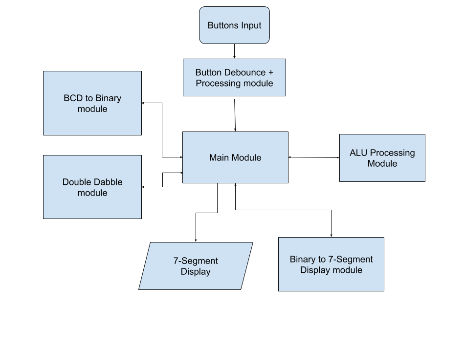
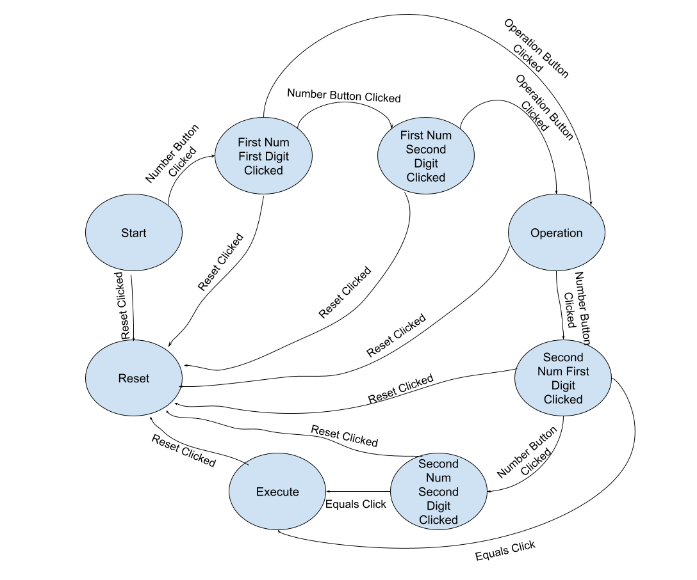
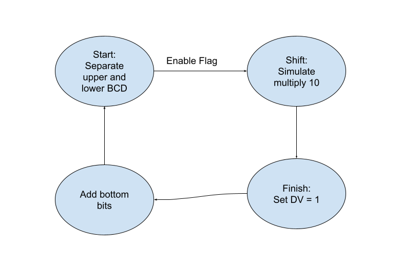

# FPGA Calculator
An FPGA calculator that I am building from scratch with the help of the GO board, an open source LATTICE board. To do this, the calculator needs a couple of parts, namely an ALU, a layer of abstraction for the hardware, a BCD to Binary converter, and a binary  to BCD converter. Everything in this project will be done in 8-bits, as the GO board only has two seven-segment displays. Below are all the details, including diagrams of the inner workings of the calculator.
 
 
Below is a general representation of how each part of the calculator interacts with one another, and how each module is instantiated. The program revolves around the state machine "Main".
 

 
I'll walk through each part of this system, explaining sort of what I did along the way, starting with "Main".

## Main State Machine:
This is the big brain mastermind of the whole calculator, the entire calculator relies on this state machine to function. This state machine will take in inputs based on the condition of the buttons and generate an operational code based on these instructions. By the time this gets to the "execute" stage, the operational code is then translated, first into the BCD to binary module, then to the ALU module, then finally back to BCD via a double dabble algorithm. The state machine for "main" is shown below:
 

 
We can also go deeper into what each state does, and how it generates the required code for the execute stage and the ALU.

## Button Hardware Layer

## Seven Segment Layer

## BCD to Binary
This BCD to Binary gets instantiated at the beginning before the always main state machine. To do this, this module takes in an "enable" signal, an input number to be converted, and a clock. This module outputs the binary representation and a output ready flag to know if the output is ready. 
 
 
This also uses a state machine, as shown below:
 

 
Once the output is ready, the module in main can use the result value. 

## Double Dabble (Binary to BCD)
The double dabble algorithm takes binary to BCD. The module takes in an array to convert, a clock and an enable signal. The output is an 8 bit BCD representation of the binary input. To do this, another state machine is required. 